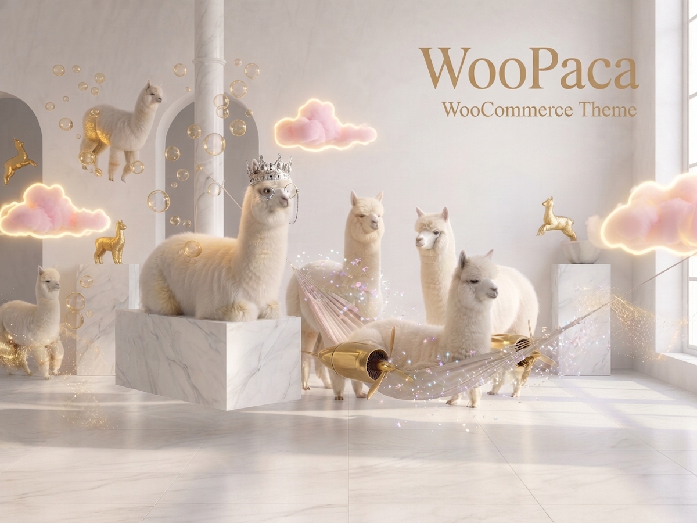
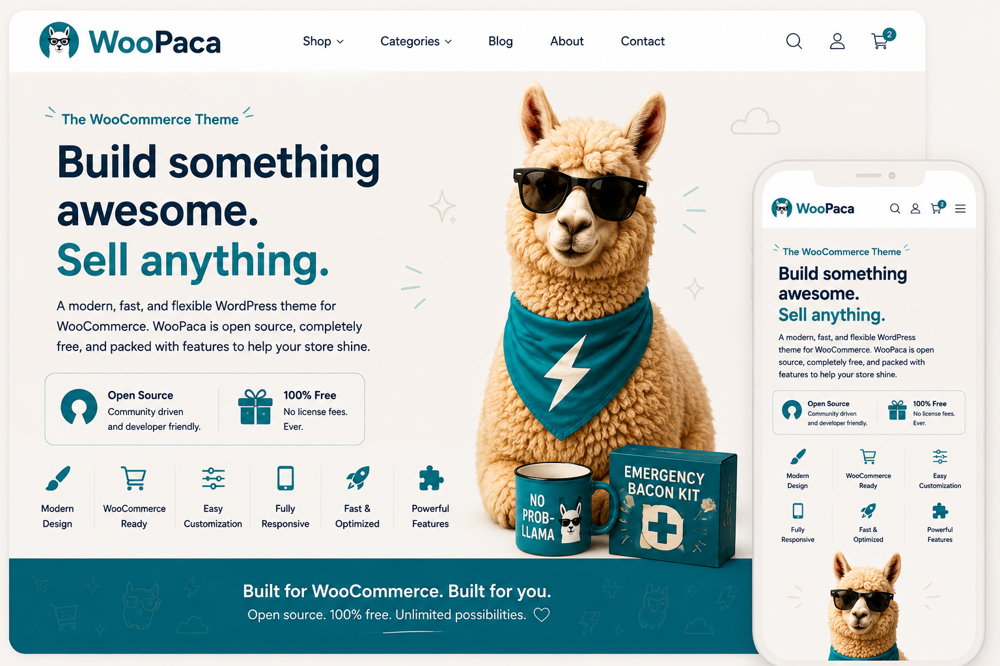
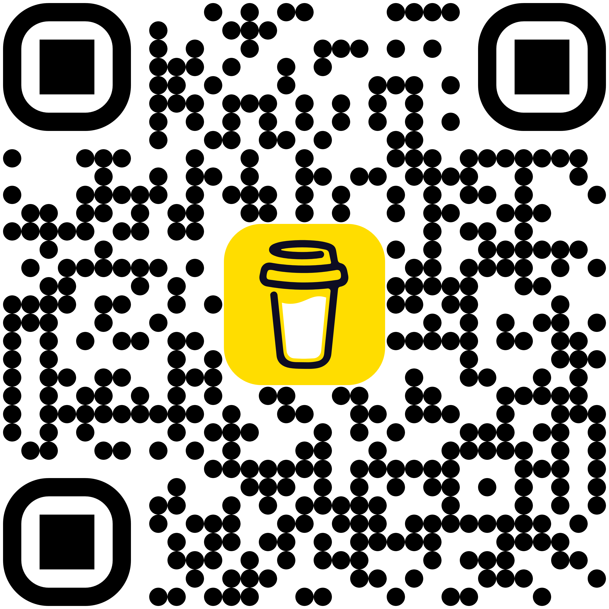
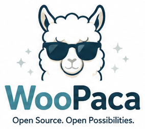

  

# The WooPaca WooCommerce Theme

WooPaca Theme was created as a single, focused project: a clean WooCommerce theme that developers can use without dealing with heavy frameworks or paying for premium options. It's free, open‑source, and built to be easy to customize for any store setup.

WooPaca is provided as is, without guarantees or active ongoing development. I don't maintain a portfolio of themes or plan future releases — this project simply exists to give developers a smoother starting point without the usual friction.

If you enjoy using WooPaca and want to support occasional tweaks or fixes when time allows, there's a BuyMeACoffee link available. It's completely optional, and always appreciated.

  

# Demo shop

<a href="https://woopaca.lasseedsvik.se" style="font-size: 32px">https://woopaca.lasseedsvik.se</a> 

## Features

Everything below is configurable from **Appearance → Customize** in wp-admin — no code editing required for day-to-day store changes.

### WooPaca Shop Settings

**Homepage section**
- Small label shown above the homepage product heading
- Homepage product section heading
- "View shop" link text
- Number of products to show (defaults to 6)
- Choose what the section pulls in: the most recently added products, or products from one specific category (with a category picker)

**Filters**
- Heading shown above the category list in the shop sidebar
- Heading shown above the price slider in the shop sidebar

**Product Layout**
- Number of product columns on desktop for the shop page and other product listings (3 or 4)

**Cart Page**
- "Empty cart" button text
- "Empty cart" confirmation dialog text (shown in the browser's confirm popup before the cart is emptied)

### WooPaca Site Settings

**Logos**
- Header logo image

**Cookie Banner**
- Message text
- Link text and URL (optional — leave either blank to hide the link)
- Accept button text
- Decline button text

**Error Page (404)**
- Pick any existing page to use as the 404 page. Leave on "None" to keep the theme's built-in 404 message and buttons instead

**Google Analytics**
- Google Analytics Measurement ID (leave blank to disable tracking entirely)

**Footer Settings**
- Footer logo image
- Opening hours heading
- Info links heading (for the Privacy Policy / Refund & Returns links — that section only appears once at least one of those pages is actually set and published)
- "Follow us" heading
- Address, phone, email, and company registration number
- Opening hours for Monday–Friday, Saturday, and Sunday
- Facebook link and Facebook QR code image
- Copyright text (the "© [year]" part is always added automatically)
- Store photo

### WooPaca Blog Settings

- Avatar image and heading/text shown next to it on the blog page
- Heading for the blog section on the homepage, and its "view full blog" link text
- Text shown before the publish date on blog posts (e.g. "Published:")
- Text for the "Back" link below a blog post
- Blog post sidebar: "See all posts" link text and the heading above the post list

## License

> This project is licensed under the **Coffeeware License**:
>
> This theme is free and open-source. As long as you retain this notice, you can do whatever you want with this stuff — use it, modify it, ship it in a client project, whatever.
>
> If we meet someday and you think this software is worth it, you can buy me a coffee in return via the BuyMeACoffee link above.
>
> No warranty is implied or provided — see the notes at the top of this README.

    

<h2 align="center" style="margin-top: 20px; font-size: 32px; font-weight: bold;">
  Lasse Edsvik   <a href="https://lasseedsvik.se" target="_blank">lasseedsvik.se</a> &middot; <a href="mailto:lasse@lasseedsvik.se">lasse@lasseedsvik.se</a>
</h2>

  

  

  

